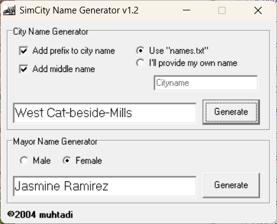

# Simcity Name Generator ( SiNG )

Originally coded in 2004 in Delphi, Simcity Name Generator was one of my earliest coding projects for which I still have the source code. I've recently rediscovered the code so I decided to upload it to GitHub and placed it under the MIT license.

## Why I made this

Back in the day I made a lot of cities in SimCity 4, and I started wanting to have a name generator for the cities I were making. There was one on Simtropolis (https://www.simtropolis.com) but it was online only and back then, my internet access was limited to dialup only so I didn't have the luxury of having the internet available all the time. Inspired by the Simtropolis name generator, I decided to create one myself in Delphi (my favourite programming language and IDE back then) and the result was a really cool tiny app that could generate millions of different names. I uploaded it to Simtropolis so others could enjoy it too, and I remember getting a few encouraging comments. While Simtropolis still exists, my app doesn't seem to be downloadable from there anymore, which is a shame. The executable, though probably first compiled under Windows XP or Windows Me (I don't remember), still surprisingly works under Windows 11!

Now in 2025, I still think it's better than the name generators found in modern city simulators. 

## How it works

The following is a copy-and-paste from the readme I originally wrote:

The Simcity Name Generator works by pulling names randomly from text
files located in the same folder as the program itself. There are 7 text
files in all, 4 to generate city names and 3 to generate mayor names.

The 4 city name files are :

a) names.txt - contains random names suitable for cities
b) prefix.txt - contains random prefixes to add in front of the city name
c) midfix.txt - contains names to add between the city name and suffix
d) suffix.txt - contains suffixes to add to the back of the city name

The Simcity Name Generator will combine the names as such:

prefix.txt + names.txt + midfix.txt + suffix.txt

If you didn't select the "add prefix" or "add middle name" options, then
the prefix and midfix values will be empty. Meaning that names generated
with the options not selected will be generated thus:

names.txt + suffix.txt

The 3 mayor name files are :

a) mayormale.txt - contains random male names
b) mayorfemale.txt - contains random female names
c) surname.txt - contains random surnames

The Simcity Name Generator will combine the names as such:

mayormale.txt + surname.txt OR
mayorfemale.txt + surname.txt

depending on which option you selected.

The Simcity Name Generator can generate much more than 25,000 possible
city names (actually it's probably close to 4 million, can't remember my
math) but if that's not enough, you can add your own city or mayor names
by editing the text files. Some generated city names can be quite
humourous (especially if you enable prefixes and midfixes)! Have fun!
